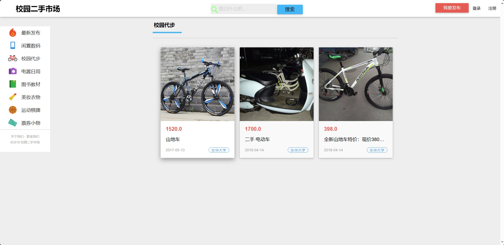
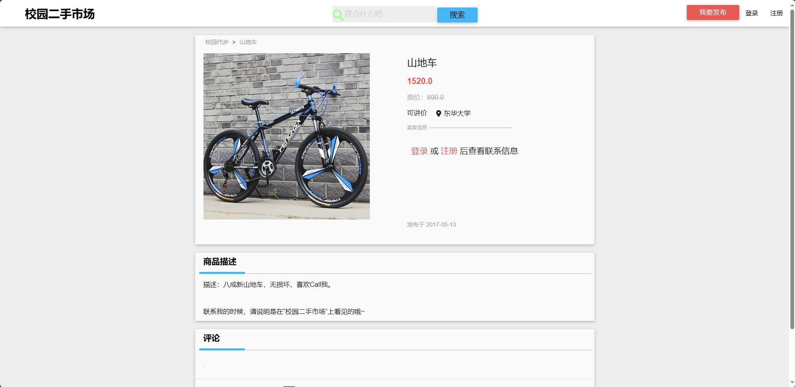

<h1 align="center">基于SSM框架的校园二手市场交易平台</h1>

 获取sql文件 QQ: 386869957 QQ群: 377586148 

 [个人站点: 从戎源码网](https://armycodes.com/)

## 简介

> 本代码来源于网络,仅供学习参考使用!
>
> 提供1.远程部署/2.修改代码/3.设计文档指导/4.框架代码讲解等服务
>
> 后台访问地址： http://localhost:8080/squirrel/admin
>
> 管理员: 13918888888 密码: 123456
>
> 用户：17862821996 密码: 123456
>

## 项目介绍

基于SSM框架的校园二手市场交易平台：前端 JSP、JavaScript、Bootstrap，后端 maven、springmvc、spring、mybatis；角色分为管理员和用户。管理员进行用户管理、商品管理、订单管理、用户余额管理、管理员密码修改等；用户按分类显示商品列表、搜索商品、登录注册、关注商品、评论商品、购买商品、用户登录后购买商品、发布商品、查看订单、查看关注的商品、修改个人信息等。主要功能如下：

### 启动方式

- 前端：
> 启动Tomcat

- 后端：
> 按钮启动

### 管理员：

- 基本操作：登录、修改个人信息、上传图片、获取个人信息、修改密码
- 用户管理：获取用户列表、筛选用户信息、查看用户详情、修改用户信息、删除用户信息
- 商品管理：获取商品列表、筛选商品信息、查看商品详情、修改商品信息、删除商品信息、新增商品、下架商品
- 订单管理：获取订单列表、筛选订单信息、修改订单信息、删除订单信息
- 钱包管理：获取钱包列表、筛选钱包信息、钱包审核

### 用户：

- 基本操作：登录、注册、修改个人信息、上传图片、获取个人信息、余额充值、余额查询、信用积分查询
- 商品管理：获取商品列表、查看商品详情、支付、关注、评论、筛选商品、关注商品、取消关注、获取关注列表、发布闲置、获取闲置列表、删除闲置
- 个人中心：获取求购列表、发布求购、获取订单列表、发货

## 环境

- <b>IntelliJ IDEA 2020.3</b>

- <b>Mysql 5.7.26</b>

- <b>Tomcat 9.0.41</b>

- <b>Maven 3.6.3</b>

- <b>JDK 1.8</b>

## 运行截图

